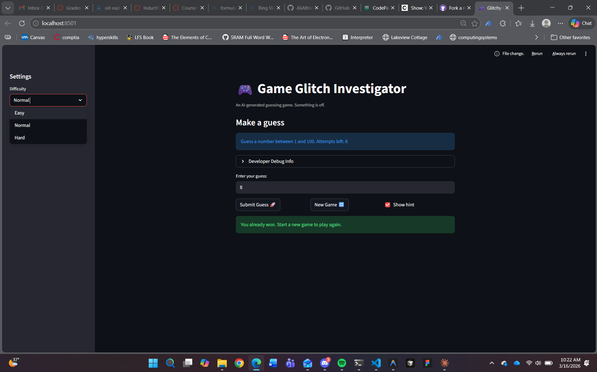

# 🎮 Game Glitch Investigator: The Impossible Guesser

## 🚨 The Situation

You asked an AI to build a simple "Number Guessing Game" using Streamlit.
It wrote the code, ran away, and now the game is unplayable. 

- You can't win.
- The hints lie to you.
- The secret number seems to have commitment issues.

## 🛠️ Setup

1. Install dependencies: `pip install -r requirements.txt`
2. Run the broken app: `python -m streamlit run app.py`

## 🕵️‍♂️ Your Mission

1. **Play the game.** Open the "Developer Debug Info" tab in the app to see the secret number. Try to win.
2. **Find the State Bug.** Why does the secret number change every time you click "Submit"? Ask ChatGPT: *"How do I keep a variable from resetting in Streamlit when I click a button?"*
3. **Fix the Logic.** The hints ("Higher/Lower") are wrong. Fix them.
4. **Refactor & Test.** - Move the logic into `logic_utils.py`.
   - Run `pytest` in your terminal.
   - Keep fixing until all tests pass!

## 📝 Document Your Experience

- [x] Describe the game's purpose.
   The game is an interactive number guessing game where the player chooses a difficulty, submits guesses, and receives feedback until they win or run out of attempts.
- [x] Detail which bugs you found.
   The core logic functions in `logic_utils.py` were unimplemented and raised `NotImplementedError`, causing all tests to fail. The app also had duplicated logic in `app.py`, reversed hint directions, and inconsistent type handling for `secret` that could break comparisons.
- [x] Explain what fixes you applied.
   I implemented all four logic functions in `logic_utils.py` (`get_range_for_difficulty`, `parse_guess`, `check_guess`, and `update_score`), refactored `app.py` to import and use them, corrected hint direction mapping, removed the `secret` type-juggling bug, and updated new-game reset behavior to use the selected difficulty range. I then verified the fixes with `python -m pytest` and all tests passed.

## 📸 Demo

- [x] [Insert a screenshot of your fixed, winning game here]

## 🚀 Stretch Features

- [ ] [If you choose to complete Challenge 4, insert a screenshot of your Enhanced Game UI here]
